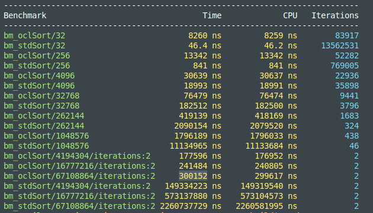

# Bitonic sort on OpenCL

Этот проект реализует алгоритм битонной (битонической) сортировки с использованием OpenCL. [Битоническая сортировка](https://ru.wikipedia.org/wiki/%D0%91%D0%B8%D1%82%D0%BE%D0%BD%D0%BD%D0%B0%D1%8F_%D1%81%D0%BE%D1%80%D1%82%D0%B8%D1%80%D0%BE%D0%B2%D0%BA%D0%B0) — это параллельный алгоритм сортировки, хорошо подходящий ускорению на GPU. Проект включает в себя OpenCL-кернелы и класс Ocl, реализующий логику сортировки.

# Сборка

Для сборки проекта понадобится
* python3
* python3-venv
* cmake

Подготовьте окружение для конана:
```
python3 -m venv ./venv 
source ./venv/bin/activate
```

И установите зависимости и запустите конан:
```
pip3 install -r requirements.txt
conan profile detect
conan install .
``` 

После остаётся только сконфигурировать проект. Конан предложит использовать определённую команду для сборки проекта, например:
```
conanfile.txt: CMakeToolchain: Preset 'conan-release' added to CMakePresets.json.
    (cmake>=3.23) cmake --preset conan-release
    (cmake<3.23) cmake <path> -G "Unix Makefiles" -DCMAKE_TOOLCHAIN_FILE=generators/conan_toolchain.cmake  -DCMAKE_POLICY_DEFAULT_CMP0091=NEW -DCMAKE_BUILD_TYPE=Release
```

Так как конан создал такую иерархию в папке build

```
./build
\
 | Release
 \
  |generators
  \
  |lots_of_files
  
```

И для вышеуказанного вывода, при cmake<3.23, сборку следует делать следующим образом:

```
cmake . -B ./build -G "Unix Makefiles" -DCMAKE_TOOLCHAIN_FILE=./build/Release/generators/conan_toolchain.cmake  -DCMAKE_POLICY_DEFAULT_CMP0091=NEW -DCMAKE_BUILD_TYPE=Release
```

Т.е. в CMAKE_TOOLCHAIN_FILE необходимо указать путь до сгенерированного toolchain'а.

Далее
 ```
cmake --build ./build
 ```

 Для запуска тестов следует выполнить
 ```
./build/tests/tests
 ```

# Использование

Чтобы использовать битоническую сортировку в вашем проекте, необходимо создать экземпляр класса ```Ocl```, который находится в файле ```ocl.hpp```, передав в конструктор путь до кернела. После этого нужно передать данные для сортировки, запустить её и получить результат.
```
#include "ocl.hpp"
#include <iostream>
#include <vector>
#include <numeric>

int main() {
    int N = 1 << 24;
    std::vector<int> v(N);
    std::iota(v.rbegin(), v.rend(), 100);
    
    Ocl app("path_to_kernel");
    
    // Загрузка данных
    app.writeToBuf(v.data(), N);
    
    // Запуск сортировки
    app.run();
    
    // Считывание результата
    app.readFromBuf(v.data());
    
    // v - 100, 101, 102 ...
}
```

# Сравнение производительности

Чтобы сравнить производительность реализации на OpenCL с ```std::sort```, запустите бенчмарки:
```
cd build
make
./benchark/bench_o2
```

Сравнение производительности происходит относительно ```std::sort``` (БЕЗ УЧЁТА ЗАГРУЗКИ/ВЫГРУЗКИ ДАННЫХ С ВИДЕОКАРТЫ) с оптимизациями -O2. Результаты бенчмарков на моём железе:
* GPU -- (GeForce RTX 4060 Max-Q / Mobile)
* CPU -- (13th Gen Intel(R) Core(TM) i7-13620H)


